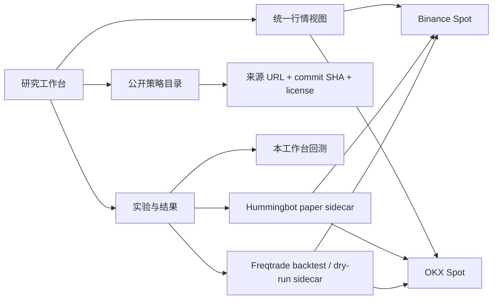

# 开源策略引擎接入研究（2026-09-27）

## 目标与当前边界

工作台继续负责多交易所行情、策略学习、统一回测记录与个人资产总览。首阶段只接入公开策略研究和模拟交易。外部引擎作为独立进程运行，工作台只读取其状态、配置和模拟结果，不传交易密钥，也不调用真实下单接口。

## 已核对的能力

| 项目 | 适合接入的能力 | 当前注意点 |
| --- | --- | --- |
| [Hummingbot](https://github.com/hummingbot/hummingbot) | 交易所连接器、脚本、持续运行的做市/网格等策略、模拟交易 | `hbot` CLI 可创建并运行 `simple_pmm` + `binance_paper_trade`；一个客户端安装只运行一个 bot。其 V2 controllers 当前不支持 paper connector，不能将所有 controller 当作可模拟运行。源码 Apache-2.0。 |
| [Hummingbot API](https://hummingbot.org/hummingbot-api/) | 多实例编排、统一状态、市场数据与回测 API | 需要独立的 PostgreSQL、EMQX 和 bot 实例；API 能控制真实交易。个人本机首版用它会增加部署和权限复杂度，待确实需要多实例时再接。 |
| [Freqtrade](https://github.com/freqtrade/freqtrade) 与 [公开策略库](https://github.com/freqtrade/freqtrade-strategies/tree/main/user_data/strategies) | 方向性策略源码学习、固定数据回测、dry-run | 公开策略库是 GPL-3.0；策略是 Freqtrade Python 类，不能作为本工作台现有 `sma_cross` 等参数直接运行。应以来源链接、版本 SHA 和独立引擎保存/运行，不把第三方源码复制到本仓库。公开策略作者也明确建议先回测再 dry-run。 |
| [币安 Spot API](https://developers.binance.com/en/docs/products/spot/rest-api) | 公开现货 K 线、盘口、成交；账户读写需独立权限 | 当前工作台已接币安公开数据与手动真实现货订单；模拟引擎不应复用真实交易密钥。 |
| [OKX API](https://www.okx.com/docs-v5/en/) | 第二交易所的现货行情、公开盘口、账户连接 | `books5` 是快照；`books` 是增量流，需要序列校验。币安和 OKX 的 symbol、精度、手续费、盘口深度及时间戳要通过交易所适配器统一。 |

Hummingbot paper connector 和 CLI 的具体调用，以上游 [Client Quickstart](https://hummingbot.org/installation/hummingbot-client/) 与 [OKX Connector](https://hummingbot.org/exchanges/okx/) 为准。Freqtrade 回测和 dry-run 的输入/输出，以上游 [回测文档](https://docs.freqtrade.io/en/stable/backtesting/) 为准。

## 接入形状

工作台与外部引擎的契约应是：`engine`、`strategy_ref`（仓库 URL + commit SHA + 类名/脚本名）、`config`（脱敏）、`market`（交易所、现货、标准化交易对）、`mode`（仅 `backtest` 或 `paper`）、`started_at`、`status`、`trades`、`fees`、`equity_curve`、`logs`、`error`。每次实验保存运行引擎版本、数据覆盖区间、费用和滑点假设。相同策略需能在相同数据集上复跑，不能只存一个收益率。

## 分阶段实施

1. **策略学习库**：已接 GitHub 文件目录，只存元数据、原始链接、许可证与 commit SHA；用户可添加“原理、入场、出场、风险、适用行情”的笔记。最近更新与规则标签待补充。公开策略作为待研究候选，不预设有效。
2. **独立模拟引擎**：首版页面提供 Hummingbot `simple_pmm` paper 的官方指引和命令，但不代用户执行。下一步检测本机 Hummingbot/Freqtrade 是否安装，在专用实例中运行已验证的 paper 配置；Freqtrade 用单独目录运行原样策略的回测和 dry-run。只有在能够验证实例隔离、当前配置确实是 paper connector，且不会触及已有真实 bot 时，工作台才允许通过有限命令白名单、超时和隔离数据目录启动进程并读取状态。未安装时显示安装指引，不自动下载或执行第三方代码。
3. **OKX 现货数据适配器**：先接公开目录、K 线、盘口，再接只读账户。统一数据模型保留原始来源和更新时间。不同交易所的订单簿不合并成一个“市场盘口”。
4. **研究比较**：同一交易对、日期、费用假设下比较原生策略、Freqtrade 与 Hummingbot 模拟结果，并展示最大回撤、交易频率、费用、执行偏差。随后再评估长期自动交易接口。

## 关键限制

- Hummingbot 的做市 paper 结果依赖实时盘口和成交假设；Freqtrade 历史回测主要依赖 OHLCV。两个结果不能只看收益率就并列排序。
- 外部策略 Python 源码属于可执行代码，不能直接在 Flask 进程内动态导入。独立进程和固定来源版本可使研究可追溯，并保护工作台的交易密钥。
- 当前仓库是 PolyForm Noncommercial。Hummingbot Apache-2.0 可独立接入；Freqtrade 策略库 GPL-3.0 的版权和再分发义务应保持在第三方项目中。首版只链接和记录元数据，不重新许可第三方代码。
